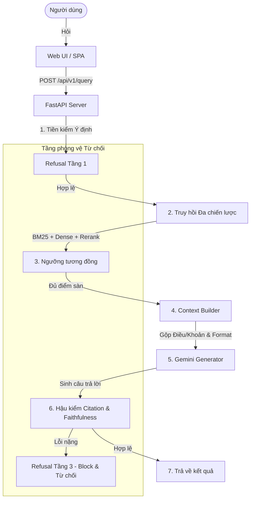

# ViLaborRAG - Hệ thống Hỏi đáp Bộ luật Lao động Việt Nam 2019

**ViLaborRAG** (Vietnamese Labor Code Question Answering with Citation-grounded Retrieval-Augmented Generation) là hệ thống hỏi đáp thông minh dựa trên kỹ thuật RAG tiên tiến, chuyên phục vụ việc tra cứu và giải thích **Bộ luật Lao động Việt Nam 2019** (Số hiệu: `45/2019/QH14`, hiệu lực từ `01/01/2021`) có trích dẫn nguồn chuẩn xác đến từng Điều/Khoản luật và tích hợp cơ chế phòng vệ chặn ảo tưởng 3 tầng.

---

## 🌟 Tính năng Nổi bật

*   **RAG có Trích dẫn Nguồn chuẩn xác (Citation-grounded RAG):** Tự động định vị và gán nhãn nguồn trích dẫn dạng `[1]`, `[2]` trong câu trả lời đồng thời đính kèm bằng chứng (Evidence) đối chiếu gốc từ văn bản luật.
*   **Hệ thống Phòng vệ 3 Tầng Từ chối (3-Layer Refusal Defense System):**
    *   *Tầng 1 (Tiền kiểm Ý định):* Tự động phát hiện và chặn các câu hỏi ngoài phạm vi Bộ luật (ví dụ: nấu ăn, thủ tục ly hôn) hoặc các câu hỏi thuộc thẩm quyền của Nghị định xử phạt hành chính (Nghị định 12/2022/NĐ-CP).
    *   *Tầng 2 (Trung kiểm Ngưỡng điểm):* Lọc điểm tương đồng (Similarity Score) của các văn bản truy hồi, từ chối trả lời khi cơ sở dữ liệu không chứa tài liệu liên quan.
    *   *Tầng 3 (Hậu kiểm Lỗi):* Kiểm định chéo chất lượng câu trả lời sinh ra, chặn hiển thị nếu phát hiện lỗi bịa luật, sai số liệu hoặc thiếu tuyên bố miễn trách nhiệm.
*   **Hậu kiểm đôi độc lập (Static & Dynamic Checkers):**
    *   *Citation Checker (Tĩnh):* Xác minh các trích dẫn pháp lý và đối khớp chuỗi ký tự bằng chứng gốc trong cơ sở dữ liệu.
    *   *Faithfulness Checker (Động):* Sử dụng giải thuật Rule-based phát hiện lệch số ngày/thời hạn kết hợp LLM-as-judge để thẩm định tính bám nguồn ngữ nghĩa.
*   **Công cụ Đánh giá ablation (Ablation Study CLI):** Chạy thực nghiệm đo lường các chỉ số Recall@k, MRR@k, Citation Accuracy, Faithfulness, và Refusal Accuracy trên nhiều cấu hình (từ A đến G).
*   **Giao diện Web tối giản & Chuyên nghiệp (FastAPI & Slate Web UI):** Giao diện Dark mode tối giản hiện đại (Slate theme), bảng điều khiển thay đổi động tham số tìm kiếm, debug console hiển thị chi tiết điểm số truy hồi trước/sau Rerank và báo cáo của Checkers.

---

## 🏗️ Kiến trúc Hệ thống

Dự án được thiết kế theo hướng **API-First** và chia cấu trúc module hóa chuẩn sản xuất:



---

## 📂 Cấu trúc Thư mục Dự án

```text
VI-Legal-RAG/
├── app/                      # Mã nguồn ASGI Web Application
│   ├── api/                  # Định tuyến REST API v1
│   │   └── v1/
│   │       ├── endpoints/    # Xử lý truy vấn và thông số hệ thống
│   │       └── router.py     # Hợp nhất endpoint
│   ├── core/                 # Quản lý dependency (Singleton RAGPipeline)
│   ├── schemas/              # Khai báo cấu trúc xác thực Pydantic
│   ├── static/               # Mã nguồn giao diện tĩnh (HTML/CSS/JS)
│   └── main.py               # Điểm khởi chạy ứng dụng FastAPI
├── configs/                  # Quản lý file cấu hình hệ thống
│   └── settings.yml          # Tham số thresholds, models, paths
├── data/                     # Dữ liệu dự án
│   ├── raw/                  # File văn bản luật thô (.txt, .pdf)
│   ├── processed/            # File corpus phân đoạn & cache chỉ mục FAISS
│   └── benchmark/            # Dữ liệu test & báo cáo thực nghiệm
├── src/                      # Lõi logic của hệ thống RAG
│   ├── ingest/               # Đọc và làm sạch văn bản luật
│   ├── chunking/             # Phân tách văn bản theo cấu trúc Chương/Điều
│   ├── retrieval/            # BM25, Dense (FAISS), Hybrid, Reranker
│   ├── generation/           # Gemini API generator
│   └── verification/         # Citation/Faithfulness Checkers & Refusal Detector
├── tests/                    # Thư mục chứa các bài kiểm thử tự động (pytest)
├── requirements.txt          # Danh sách gói thư viện phụ thuộc
├── run_evaluation.py         # Script CLI chạy đánh giá ablation study
└── README.md                 # Tài liệu hướng dẫn sử dụng này
```

---

## 🚀 Hướng dẫn Cài đặt & Sử dụng

### 1. Chuẩn bị Môi trường

Đảm bảo bạn đã cài đặt **Python 3.10** hoặc **3.11** trở lên.

```bash
# Tạo môi trường ảo
python -m venv .venv

# Kích hoạt môi trường ảo
# Trên Windows:
.venv\Scripts\activate
# Trên macOS/Linux:
source .venv/bin/activate

# Cài đặt các gói thư viện phụ thuộc
pip install -r requirements.txt
```

### 2. Cấu hình Khóa API (API Key)

Hệ thống sử dụng mô hình **Gemini 2.5 Flash** cho phần sinh văn bản và hậu kiểm.
Để cấu hình khóa API:
1. Hãy tạo tệp tin `.env` nằm tại thư mục gốc của dự án.
2. Nhập khóa API của bạn theo định dạng:
   ```env
   GEMINI_API_KEY=your_actual_gemini_api_key
   ```

*(Lưu ý: Nếu không có khóa API, hệ thống sẽ tự động khởi chạy ở **Chế độ Giả lập (Mock Fallback Mode)**. Ở chế độ này, hệ thống vẫn thực thi tìm kiếm thực tế trên FAISS database và trả về các đoạn văn bản luật thật tương ứng để bạn kiểm thử offline dễ dàng).*

### 3. Khởi chạy Ứng dụng Web (Web UI)

Khởi động máy chủ API FastAPI (Uvicorn):

```bash
python -m uvicorn app.main:app --port 8000 --reload
```

Sau khi khởi chạy thành công, mở trình duyệt web và truy cập địa chỉ:
👉 **[http://localhost:8000](http://localhost:8000)**

### 4. Chạy Đánh giá ablation study (Benchmark)

Để chạy đánh giá ablation các cấu hình hệ thống (ví dụ: Config G):

```bash
python run_evaluation.py --benchmark_path data/benchmark/benchmark_sample.json --config G
```

### 5. Chạy Kiểm thử Tự động (Tests)

Hệ thống được thiết kế theo quy trình TDD nghiêm ngặt, chạy toàn bộ test suite:

```bash
pytest
```

---

## 🛠️ Chi tiết Kỹ thuật Giao diện (Web UI)

*   **Sidebar Config:** Cho phép người dùng tùy chọn chiến lược truy hồi (`Hybrid + Reranker` (Khuyên dùng), `Hybrid`, `Dense Semantic`, hoặc `BM25`), thay đổi số lượng văn bản cần tìm kiếm (Top-K) và bật cờ **Bypass Refusal** phục vụ debug.
*   **Trình diễn nguồn accordion:** Phía dưới câu trả lời, các nguồn trích dẫn được phân loại thành các card nhỏ, khi nhấp vào sẽ mở rộng để hiển thị chính xác đoạn bằng chứng pháp lý (evidence) và đường dẫn liên kết đầy đủ.
*   **Debug Console (Footer):**
    *   *Tab 1 (Văn bản truy hồi):* Hiển thị bảng chi tiết các văn bản thô được tìm kiếm, kèm điểm số tương đồng (score).
    *   *Tab 2 (Kết quả Hậu kiểm):* Nhật ký kiểm tra tính bám nguồn và tính pháp lý của hai Checkers.
    *   *Tab 3 (Chỉ số Hệ thống):* Thống kê độ trễ phản hồi (latency), độ tự tin (confidence), và cấu hình hoạt động hiện hành.
