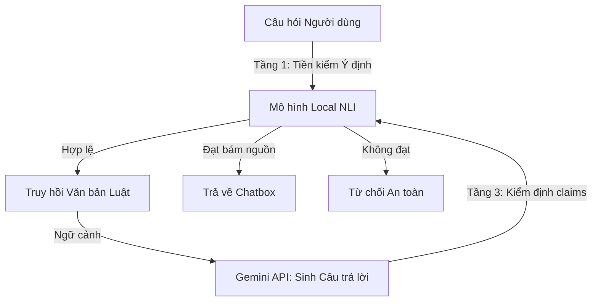

# Báo cáo Nghiên cứu: Khắc phục Lỗi Từ chối Phục vụ & Tối ưu hóa Hệ thống ViLaborRAG bằng Mô hình NLI Cục bộ

Tài liệu này định nghĩa rõ các vấn đề kỹ thuật hiện tại của hệ thống hỏi đáp ViLaborRAG dẫn đến tình trạng từ chối sai (Over-refusal), phân tích giải pháp ưu tiên tích hợp mô hình NLI (Natural Language Inference) cục bộ, và lập luận tính hợp lý của phương án này.

---

## 1. Định nghĩa Vấn đề Hiện tại (Problem Definition)

Hệ thống ViLaborRAG hiện tại đang gặp phải **3 rào cản lớn** làm suy giảm trải nghiệm người dùng và tăng chi phí vận hành:

### Vấn đề A: Lỗi Lệch Ngữ Cảnh tại Tầng Truy hồi (Retrieval Stage Gap)
*   **Mô tả:** Khi người dùng hỏi các câu hỏi thực tế có tính liên đới nhiều Điều luật (ví dụ: hỏi *"Lương đi làm ngày Tết"* vừa liên quan đến việc nghỉ lễ ở **Điều 112** vừa liên quan đến đơn giá làm thêm giờ ở **Điều 98**), hệ thống truy hồi từ khóa hoặc ngữ nghĩa cơ bản có xu hướng chỉ lấy được Điều luật có từ khóa khớp mạnh nhất (Điều 112).
*   **Hậu quả:** Thiếu thông tin Điều 98 làm LLM không thể trả lời đúng tỷ lệ lương 300%. Nếu LLM trả lời theo kiến thức sẵn có, nó sẽ bị các bộ lọc an toàn chặn lại vì "thông tin không có trong ngữ cảnh truy hồi".

### Vấn đề B: Bộ Hậu Kiểm Số Thô Quá Khắt Khe (Over-strict Numeric Checking)
*   **Mô tả:** Hàm `check_numeric_discrepancy` so khớp tuyệt đối tất cả các chữ số trong câu trả lời với văn bản luật gốc.
*   **Hậu quả:** Chatbot bị tước đi khả năng thực hiện phép tính thực tế hoặc đưa ra ví dụ trực quan. Nếu người dùng hỏi lương ngày thường là `500.000đ` thì lương đi làm lễ là bao nhiêu, LLM tính ra `1.500.000đ` nhưng con số này lập tức bị coi là "bịa đặt" (hallucination) do không tồn tại trong văn bản luật gốc.

### Vấn đề C: Chi phí Token & Độ trễ Mạng Lớn từ Gemini API (API Latency & Quota Overhead)
*   **Mô tả:** Hệ thống hiện tại đang sử dụng Gemini API làm trọng tài thẩm định ngữ nghĩa cho từng câu khẳng định (claims) ở Tầng 3 (Faithfulness Checker) và phân loại ý định ở Tầng 1 (Intent Refusal).
*   **Hậu quả:** 
    *   **Độ trễ cao:** Thực hiện tuần tự nhiều cuộc gọi API qua mạng làm chậm tốc độ phản hồi của chatbox (mất 5-8 giây cho một câu hỏi).
    *   **Tốn token:** Trình thẩm định claims tiêu thụ lượng token rất lớn và dễ chạm ngưỡng giới hạn lượt gọi (Rate Limit - Error 429).

---

## 2. Hướng Giải quyết Được Ưu tiên (Prioritized Solution)

Giải pháp tối ưu và được ưu tiên nhất hiện tại là **Tích hợp một mô hình NLI (Natural Language Inference) cục bộ (như PhoBERT-NLI hoặc mDeBERTa-v3) chạy hoàn toàn offline trên server FastAPI** để thay thế Gemini API tại Tầng 1 (Tiền kiểm) và Tầng 3 (Hậu kiểm Faithfulness).

### Cách thức hoạt động của Mô hình NLI cục bộ:
1.  **Tại Tầng 1 (Intent Refusal):** Chạy phân loại Zero-shot cục bộ. So sánh mức độ kéo theo (Entailment) giữa câu hỏi và các nhãn từ chối (ví dụ: *"Câu hỏi này nằm ngoài phạm vi Luật Lao động"*). Nếu điểm kéo theo vượt ngưỡng, hệ thống từ chối ngay lập tức.
2.  **Tại Tầng 3 (Faithfulness Checker):** Phân tách câu trả lời của Gemini thành các câu đơn (Claims). Với mỗi Claim, đưa vào mô hình NLI làm Giả thuyết (Hypothesis) đối chiếu với văn bản luật gốc làm Tiền đề (Premise). Nếu mô hình trả về nhãn `Entailment` với độ tự tin cao $\rightarrow$ Chấp nhận.

---

## 3. Vì sao Giải pháp này Hợp lý và Thực tế? (Justification)

Phương án này mang lại 4 lợi ích chiến lược vượt trội:

### 1. Tối ưu hóa Token & Giảm chi phí vận hành (Cost Saving)
*   Thay vì gọi Gemini API từ 3 đến 6 lần cho một lượt chat (Intent check + Sinh văn bản + Kiểm tra từng claim), hệ thống sẽ **chỉ gọi duy nhất 1 lần** cho bước Sinh câu trả lời. 
*   Điều này giúp tiết kiệm tới 70-80% chi phí token và giảm tối đa rủi ro chạm hạn mức quota (Error 429).

### 2. Tăng Tốc độ Phản hồi Hệ thống (Latency Reduction)
*   Inference của một mô hình NLI nhỏ (PhoBERT-NLI khoảng 100M-300M parameters) chạy cục bộ chỉ mất khoảng **50 - 150ms** cho một cặp câu. 
*   Loại bỏ hoàn toàn độ trễ đường truyền internet của 4-5 request Gemini tuần tự, giúp chatbox hoạt động mượt mà tức thì.

### 3. Tăng tính Bao dung Ngữ nghĩa (Semantic Entailment)
*   Khác với việc so khớp từ ngữ cứng nhắc, NLI hiểu được sự tương đồng về mặt ý nghĩa. 
*   Nếu Gemini diễn đạt lại luật bằng ngôn ngữ tự nhiên hoặc sắp xếp lại cấu trúc câu cho dễ hiểu (rephrase), mô hình NLI vẫn nhận diện đúng quan hệ `Entailment` (Kéo theo logic). Điều này giúp giảm thiểu hiện tượng từ chối oan (False Refusal) khi câu trả lời hoàn toàn đúng về mặt bản chất pháp lý nhưng khác câu chữ.

### 4. Tận dụng Cơ sở Hạ tầng Sẵn có (Resource Synergy)
*   Dự án hiện tại đã nạp sẵn thư viện PyTorch/SentenceTransformers để phục vụ mô hình Dense Embedding BGE-M3 và Reranker.
*   Việc bổ sung thêm mô hình NLI qua lớp `CrossEncoder` không đòi hỏi cài đặt thêm thư viện mới, dung lượng RAM phát sinh thêm rất nhỏ (~300MB - 500MB) hoàn toàn nằm trong tầm kiểm soát của server.

---

## 4. Hướng đi Tiếp theo & Các bước Triển khai

Để hiện thực hóa giải pháp này, lộ trình phát triển sẽ bao gồm các bước sau:

### Bước 1: Nâng cấp Bộ lọc Số học (Arithmetic Filter Bypass)
*   Bổ sung logic trong `check_numeric_discrepancy` để trích xuất và loại trừ các con số do người dùng cung cấp (input variables) hoặc các số là kết quả của phép toán số học thực tế (đối chiếu qua kiểm tra tỷ lệ phần trăm/phép nhân).

### Bước 2: Tải và Tích hợp Mô hình NLI cục bộ
*   Nạp mô hình `symper/vietnamese-nli-model` hoặc `MoritzLaurer/mDeBERTa-v3-base-xnli-multilingual-nli-2mil7` thông qua `sentence_transformers.CrossEncoder`.
*   Cấu hình quản lý vòng đời (Lifespan event) trong FastAPI tại [dependencies.py](file:///c:/Users/USER/Desktop/NLP_project/VI-Legal-RAG/app/core/dependencies.py) để tải mô hình NLI vào RAM một lần duy nhất lúc khởi động hệ thống.

### Bước 3: Tái cấu trúc pipeline
*   Chuyển đổi logic của [refusal_detector.py](file:///c:/Users/USER/Desktop/NLP_project/VI-Legal-RAG/src/verification/refusal_detector.py) (Tầng 1) và [faithfulness_checker.py](file:///c:/Users/USER/Desktop/NLP_project/VI-Legal-RAG/src/verification/faithfulness_checker.py) (Tầng 3) sang sử dụng bộ dự đoán của mô hình NLI cục bộ thay vì gửi prompt lên Gemini API.
